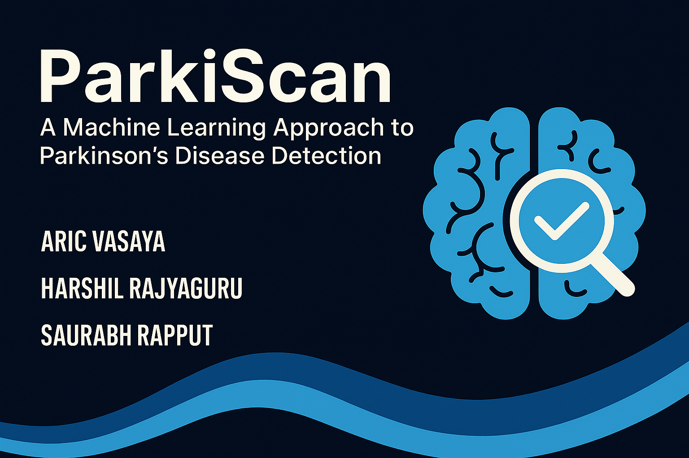

<!-- Cover Image -->
<p align="center">
  
</p>

<h1 align="center">🧠 Parkinson's Disease Detection using Machine Learning</h1>

<p align="center">
<i>A sleek, smart and research-backed project that uses data and AI to support early detection of Parkinson’s Disease.</i></p>

<p align="center">
  
  
  
</p>

---

## 📌 About the Project

Parkinson’s Disease (PD) is a progressive nervous system disorder that affects movement. With timely detection, patients can receive early treatment and manage symptoms more effectively.

This project leverages cutting-edge machine learning algorithms and biomedical voice measurements to detect potential signs of Parkinson’s Disease. Using a dataset of vocal biomarkers, our model learns to distinguish between healthy individuals and those affected by PD.

---

## 📊 Dataset Used

- **Source**: UCI Machine Learning Repository
- **Type**: Biomedical voice measurements from individuals (both healthy and with Parkinson’s)
- **Features**: MDVP (vocal measures), jitter, shimmer, HNR, and more

---

## 🧪 Technologies & Tools

- Python 3.10+
- Jupyter Notebooks
- NumPy, Pandas
- Scikit-learn
- Matplotlib & Seaborn
- Streamlit (for the web interface)
- Git & GitHub

---

## 🧠 ML Models Used

- Decision Tree
- Random Forest
- Logistic Regression
- Naive Bayes
- K-Nearest Neighbors
- XGBoost

Each model was trained and evaluated using cross-validation techniques. Accuracy, precision, recall, and F1 scores were compared to select the most optimal model.

## 📈 Performance Metrics

| Model               | Accuracy | Precision | Recall | F1-Score |
|--------------------|----------|-----------|--------|----------|
| Decision Tree      | 94.92%   | 96.43%    | 93.10% | 94.74%   |
| Random Forest      | 100%     | 100%      | 100%   | 100%     |
| Logistic Regression| 86.44%   | 86.21%    | 86.21% | 86.21%   |
| Naive Bayes        | 86.44%   | 100%      | 72.41% | 84%      |
| K-Nearest Neighbors| 96.61%   | 96.55%    | 96.55% | 96.55%   |
| XGBoost            | 100%     | 100%      | 100%   | 100%     |


---

## 🚀 How to Run

1. Clone this repo:
```bash
git clone https://github.com/aric1605/ParkiScan-A-Machine-Learning-Approach-to-Parkinson-s-Disease-Detection.git
```

2. Install dependencies:
```bash
pip install -r requirement.txt
```
3. Run!!

---

## 🧑‍🎨 Meet the Crew

| 🧑‍💻 Name              | 🎓 Enrollment No. |
|-----------------------|------------------|
| **Aric Vasaya**       | 23ucs733         |
| **Harshil Rajyaguru** | 23ucs688         |
| **Saurabh Rajput**    | 23ucs687         |

A team of creative technologists blending **code, color, and compassion** to make a difference.

---

## 🙌 Want to Contribute?

We welcome **collaborators** and **designers** who want to enhance awareness through visuals.

📧 Drop us a message or open an issue! Let’s spread knowledge through creativity.

---

## 📄 License

This project is open-source and free to use under the MIT License.

---

<p align="center">
✨ Empowering early diagnosis with data and technology ✨
</p>
